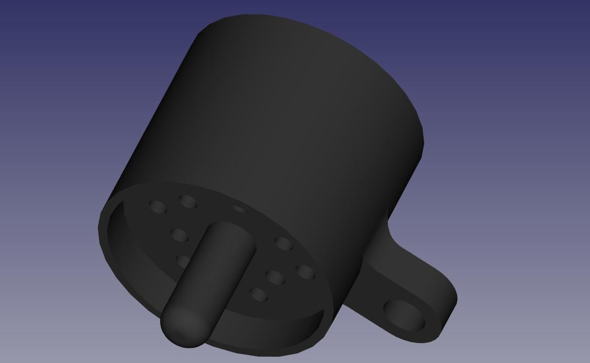
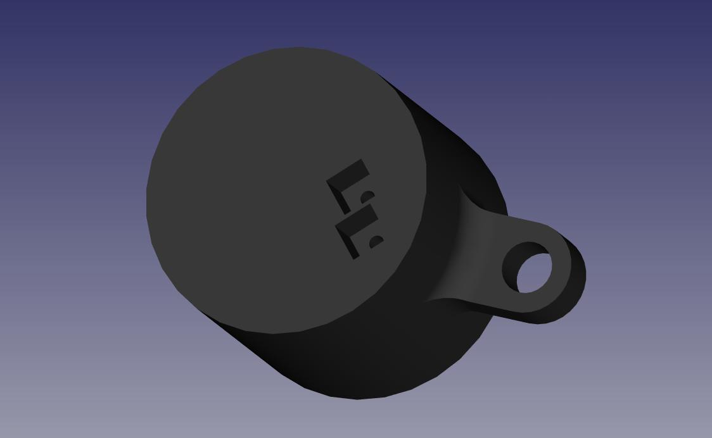
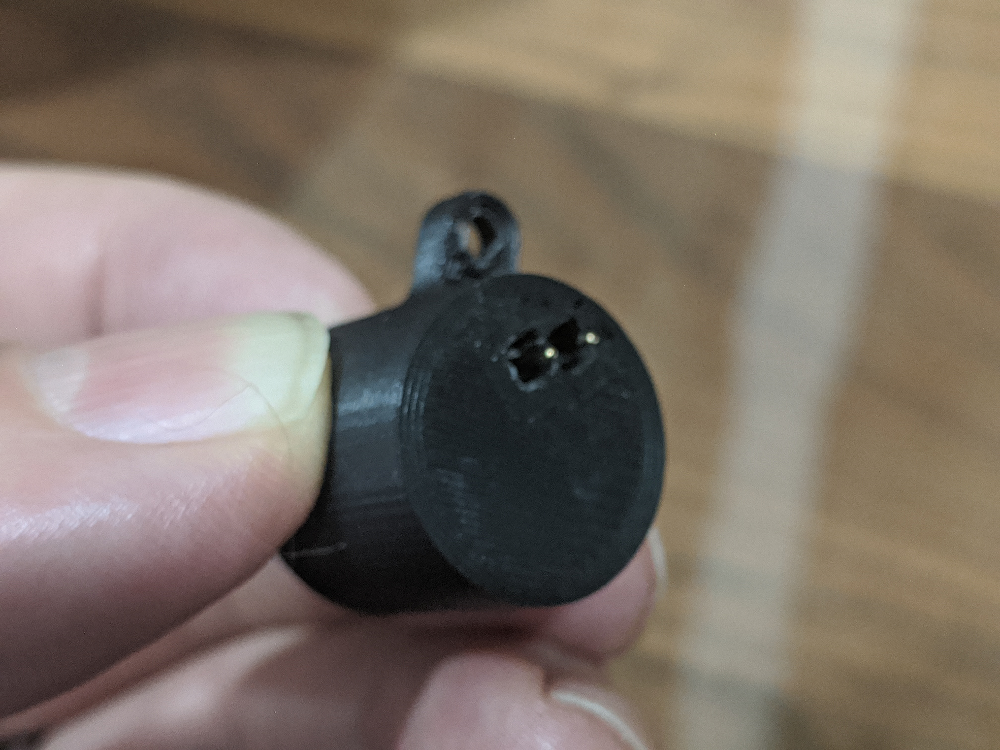
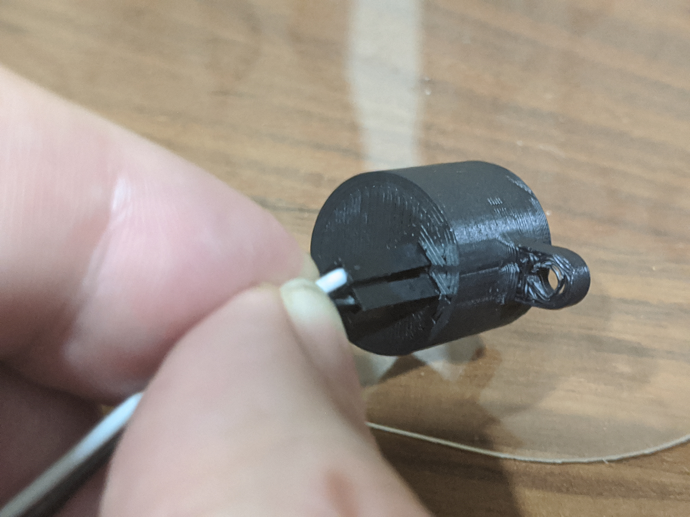
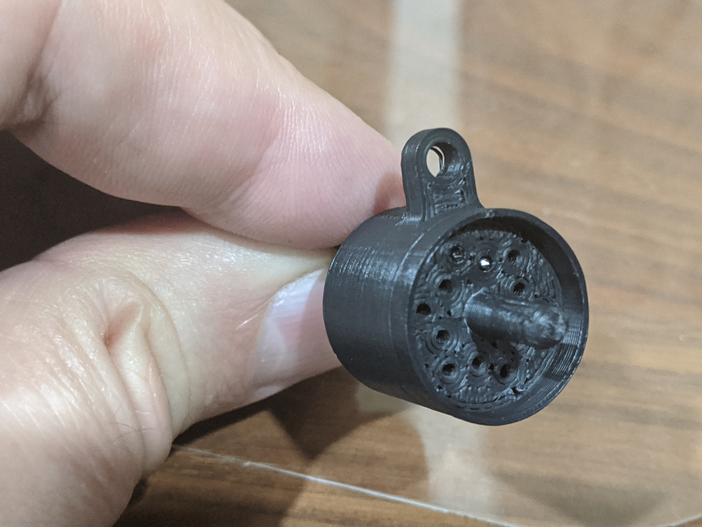

# tk-x90-basic-programmer

 
This work is licensed under a <a rel="license" href="http://creativecommons.org/licenses/by-sa/4.0/">Creative Commons Attribution-ShareAlike 4.0 International License</a>.

Please attribute the work to *Rob Riggs, WX9O, Mobilinkd LLC*.

FreeCAD Model for the basic programmer connector for the Kenwood TK-x90
radios.  This model is designed to work with the Kenwood TK-690, TK-790,
and TK-890 radios.

<table>
  <tr>
    <td>
      

        
      

    </td>
    <td>
      

        
      

    </td>
  </tr>
</table>

To build the connector, you will need:

 1. 2 P50-E2 pogo pins
 1. 2 Hookup wires, at least 20cm/8", with male and female Dupont connectors.
 1. M2.5x8mm screw
 1. DMM or continuity tester

The model is designed to be 3D-printed with the flat part on the bottom.
You will need a printer with fairly high dimensional accuracy.  The model
has holes designed to fit a P50-E2 pogo pin, and a 2.54mm square Dupont
connector.  There is less than 0.5mm tolerance in the hole diameter and
in the connector socket.  Any amount of over-extrusion is going to cause
the openings to be too narrow to fit the pins and connectors.

I printed the model at 0.15mm layer height to keep the walls reasonably
smooth.  Put supports inside the square holes and under the tab for the
screw hole.  The parts were printed with 25% hexagonal infill.

Push the two pogo pins into the hole from the side with the locating
pin.  The pogo pin shafts should protrude a few mm above the base of
the connector housing.

Push the Dupont connectors over the pogo pin shaft and into the
receptable until it bottoms out.  Use a thin stiff wire (I used the
shaft of an E75 pogo pin) to push the two pogo pins up until the shafts
are well seated into the Dupont connector.

<table>
  <tr>
    <td>
      

        
      

    </td>
    <td>
      

        
      

    </td>
    <td>
      

        
      

    </td>
  </tr>
</table>

Use the DMM to verify that there is continuity from the tip of the pins
to the corresponding male ends of of the connector wires.

Fit the connector to the radio.  Use the M2.5 screw to fasten the
programmer connector to the radio.

<table>
  <tr>
    <td>
      

        
      

    </td>
  </tr>
</table>

The pin/connector nearest the outer edge is ground.  The one furthest in
from the edge is the data pin.  You should be able to verify continuity
from the ground wire to the radio chassis.

